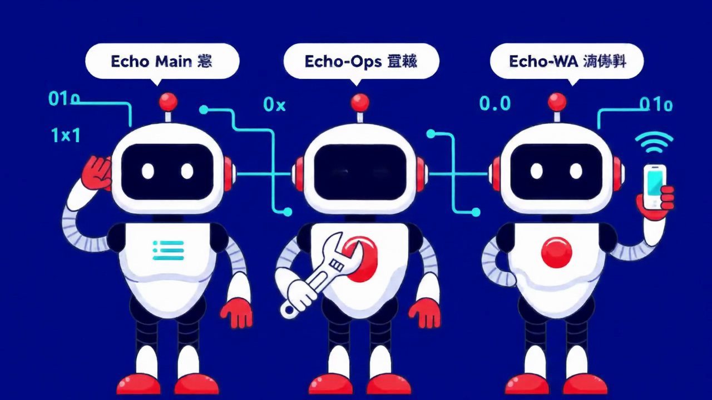
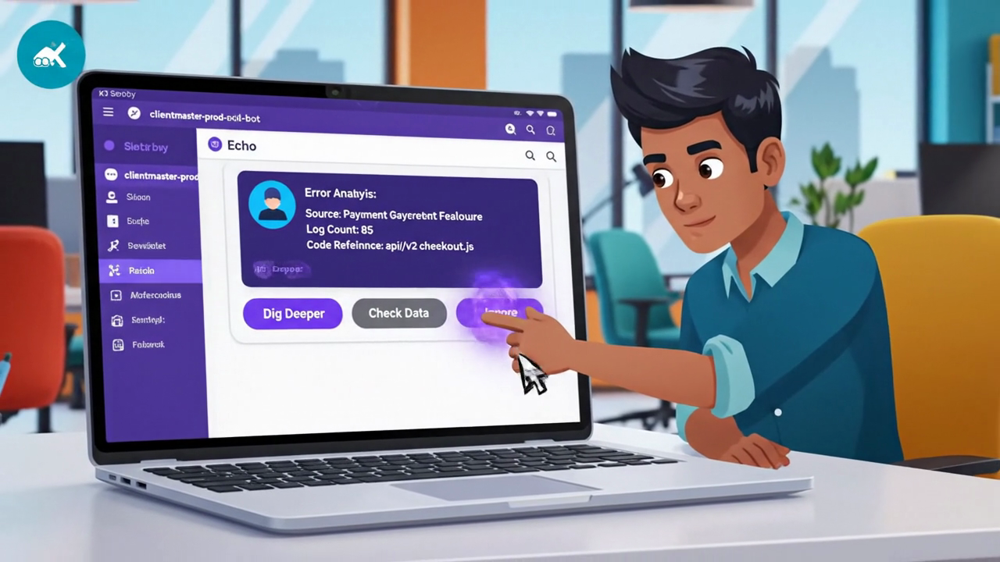
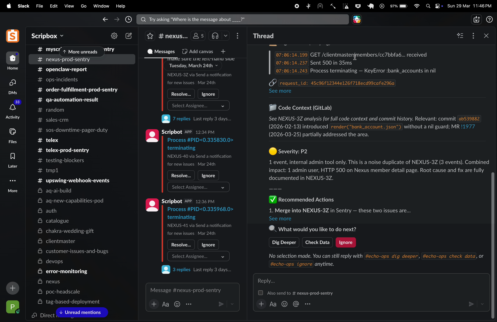
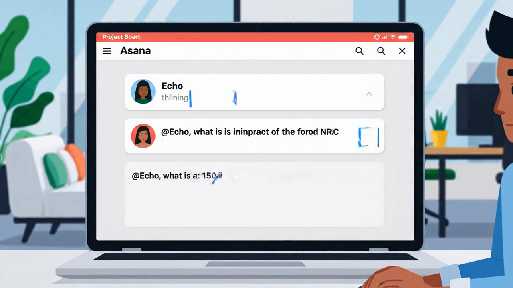
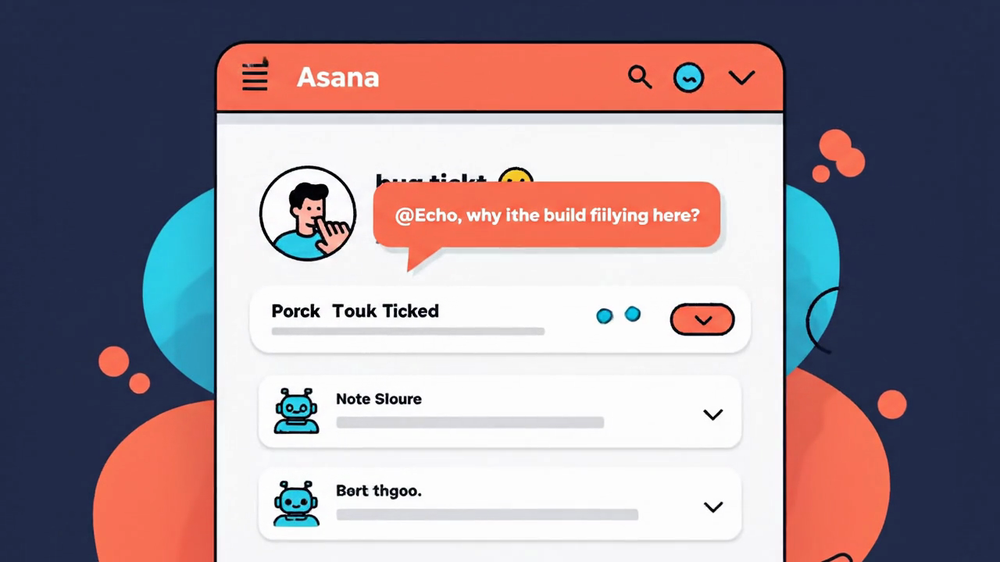
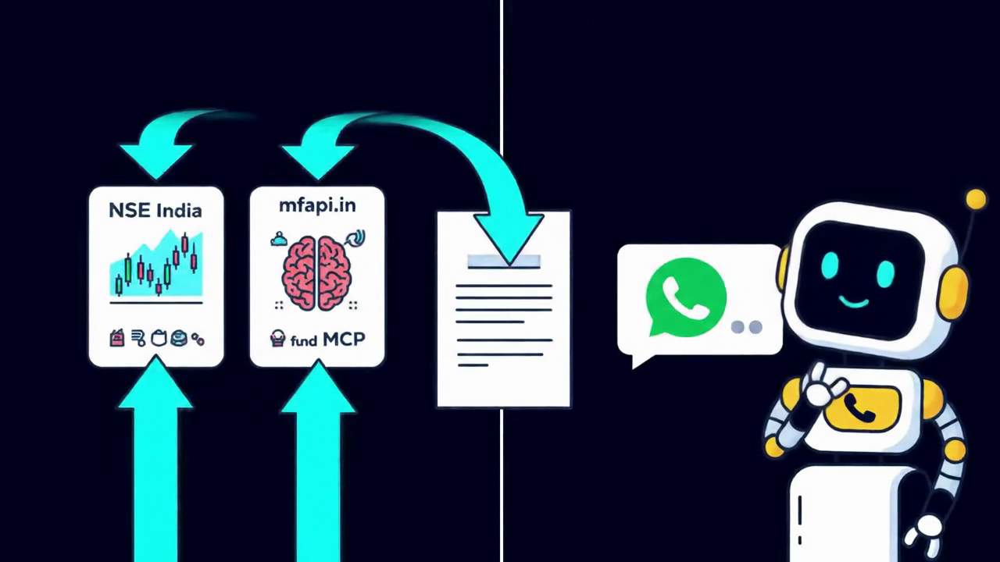
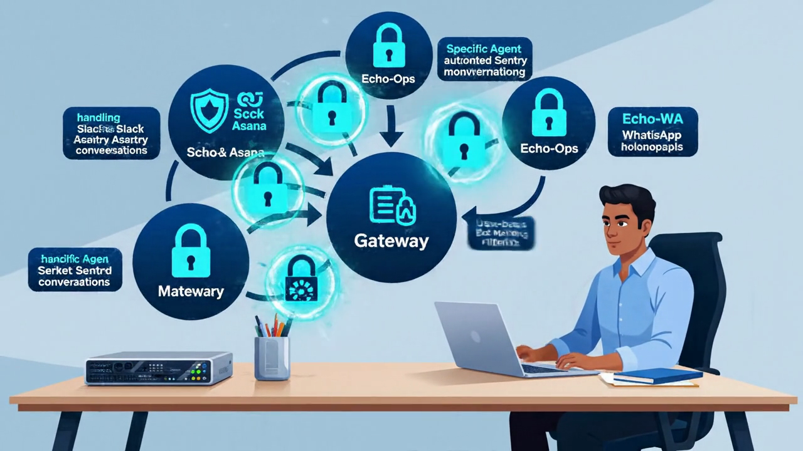

<div align="center">

# Echo 🫡

### Your AI Ops Team That Never Sleeps

**Scripbox's multi-agent AI operations platform — built on Claude, powered by OpenClaw**

[](https://drive.google.com/file/d/1luekhTV4Y0NmPsa-QF6ve6MZ00Fa9OrL/view?usp=drive_link)
[](https://anthropic.com)
[](https://www.apple.com/mac-mini/)

[](https://drive.google.com/file/d/1luekhTV4Y0NmPsa-QF6ve6MZ00Fa9OrL/view?usp=drive_link)

*Click to watch the 2-minute demo video*

</div>

---

## The Problem

Scripbox engineering faces **200+ production errors daily** across 7 microservices. Each error requires manual triage — checking Sentry for stack traces, Graylog for logs, GitLab for code changes, and Asana for ticket context.

**Before Echo:**
- 15-30 minutes per error for manual investigation
- Bug tickets pile up unclassified in Asana
- Cross-service errors missed entirely
- Weekly newsletters require manual data collection
- Developers spend mornings on reactive ops instead of building

---

## The Solution: Three Agents, One Brain

Echo is a **multi-agent AI system** that handles production operations autonomously. Three specialized agents run 24/7 on a Mac Mini under someone's desk.

<div align="center">

</div>

| Agent | Role | What It Does |
|-------|------|-------------|
| **Echo Main 🫡** | Conversations | Answers @Echo mentions in Asana and Slack. Investigates, cross-references, and replies with detailed analysis. |
| **Echo-Ops 🔧** | Operations | Monitors 7 Sentry channels every 15 min. Auto-analyzes errors with Sentry + Graylog + GitLab. Posts interactive triage buttons. |
| **Echo-WA 📱** | Newsletter | Sends weekly WhatsApp newsletters with live Nifty, Sensex, and mutual fund NAV data. Zero human effort. |

---

## Feature Showcase

### 1. Interactive Sentry Triage

Echo-Ops monitors 7 production Sentry channels. When an error arrives, it:
1. Fetches the full Sentry stack trace
2. Searches Graylog for correlated logs (±5 min window)
3. Checks GitLab for recent code changes at the error location
4. Posts a structured analysis as a Slack thread reply
5. Offers **interactive Block Kit buttons** for next steps

<div align="center">

</div>

**Buttons:**
- **Dig Deeper** — Extended Graylog trace, GitLab blame, related MRs
- **Check Data** — Runs Metabase queries to verify affected records
- **Ignore** — Marks as triaged, saves decision to knowledge base

**Slack Interactive Triage — Live Screen Recording:**

<div align="center">
<video src="https://github.com/Pranavj17/echo-demo/raw/main/assets/slack_demo.mp4" width="700" controls></video>
</div>

<div align="center">

</div>

<div align="center">

</div>

---

### 2. Automated Asana Bug Triage

Every new bug ticket in Asana is automatically:
- **Classified** as data issue vs code/system issue using multi-source scoring
- **Analyzed** with Sentry + Graylog + GitLab cross-referencing
- **Tagged** with `ai-triaged`, `data-issue`, or `code-issue`
- **Enriched** with an AI analysis file attachment (not just a comment)

<div align="center">

</div>

#### Real Example: Asana Ticket Investigation

Here's an actual ticket where Echo was asked to investigate a CRM mirror view issue:

> **Ticket:** Issue with the mirror client view on the web
>
> **Echo's AI Triage** identified the service (CRM), member UUID, and checked Sentry/Graylog/GitLab for traces.
>
> **@Echo was then asked** to check auth and clientmaster databases for lead_id mismatch.
>
> **Echo investigated** — queried Metabase, found the investor record (id 1064799), traced the user linkage, discovered the lead_id `5275c4df-73d4-11ec-90a7-02ee030c3f8e` exists in users table but has no matching leads record.
>
> **Echo's conclusion:** _"This looks like a data issue rather than a code/platform bug. The mirror client view depends on resolving the lead → user chain. Since the lead_id is missing from auth and no leads record exists in clientmaster, the CRM mirror lookup fails."_
>
> — Echo 🫡

---

### 3. Conversational @Echo

Ask Echo anything on a ticket or in Slack. It thinks first, investigates across services, and replies with structured analysis.

<div align="center">

</div>

**Works in:**
- **Asana** — Comment `@Echo <question>` on any ticket
- **Slack** — Mention `@openclaw` in any Sentry channel

**Echo can:**
- Cross-reference errors across services
- Query databases via Metabase
- Check recent GitLab MRs and blame
- Search Graylog logs with time-windowed queries
- Provide root cause analysis with evidence

---

### 4. WhatsApp Newsletter

Every Monday, Echo-WA automatically:
1. Fetches live **Nifty 50** data from NSE India
2. Pulls **mutual fund NAVs** (SBI Bluechip, HDFC Flexi Cap, Axis Midcap) from mfapi.in
3. Loads the **weekly investment theme** from Memory MCP
4. Formats a beautiful WhatsApp newsletter (800-1200 chars)
5. Sends to the Scripbox WhatsApp group
6. Logs the send to Memory MCP for deduplication

<div align="center">

</div>

**Actual newsletter sent by Echo to WhatsApp:**

<div align="center">

</div>

**Deduplication:** Checks `newsletter.sent.{YYYY-Wnn}` key before sending — will never double-send.

---

### 5. Seven-Channel Monitoring Dashboard

<div align="center">

</div>

Echo-Ops monitors these production Sentry channels every 15 minutes:

| Channel | Service |
|---------|---------|
| `#clientmaster-prod-sentry` | clientmaster |
| `#auth-prod-sentry` | auth |
| `#nexus-prod-sentry` | nexus |
| `#milky-way-prod-sentry` | milky-way |
| `#heimdall-prod-sentry` | heimdall |
| `#order-fulfillment-prod-sentry` | order-fulfillment |
| `#myscripbox-api-prod-sentry` | myscripbox |

---

## Architecture

<div align="center">

</div>

```
                    ┌─────────────────┐
                    │   OpenClaw GW    │
                    │   (Mac Mini)     │
                    └────────┬────────┘
                             │
              ┌──────────────┼──────────────┐
              │              │              │
        ┌─────┴─────┐ ┌─────┴─────┐ ┌─────┴─────┐
        │  Echo 🫡   │ │ Echo-Ops 🔧│ │ Echo-WA 📱│
        │   main     │ │ operations │ │ whatsapp  │
        └─────┬─────┘ └─────┬─────┘ └─────┬─────┘
              │              │              │
         Slack DMs      Sentry Poll    WA Group
         @Echo Q&A      Asana Triage   Newsletter
         Asana Echo     KB Maintenance
```

**Infrastructure:**
- **Host:** Mac Mini M4 Pro — Apple Silicon, 12 cores, 24GB RAM
- **Model:** Claude Sonnet 4 (via Anthropic API)
- **Gateway:** OpenClaw v2026.3.24, port 18789
- **Sandbox:** Podman containers for non-main agents
- **Memory:** PostgreSQL-backed MCP server (shared across agents)
- **Channels:** Slack (Socket Mode) + WhatsApp + Asana webhooks

**No cloud infrastructure required.** Everything runs locally on a single Mac Mini.

---

## RBAC & Permissions

Every agent, every channel — permission-controlled with zero crosstalk.

```
🔒 Channel-Level Access Control

#sentry-channels  → echo-ops only (requireMention: true)
#pranav-direct    → main agent (requireMention: false)
WhatsApp group    → echo-wa only (bound by group ID)

👤 Agent-Based Rules:
  • Bot messages → allowBots: true (Sentry channels)
  • Human messages → allowBots: false (direct channels)
  • Group policy → "open" (Slack) vs "allowlist" (WhatsApp)
```

---

## Cron Jobs

| Job | Interval | Agent | Purpose |
|-----|----------|-------|---------|
| `sentry-poll-all` | 15 min | echo-ops | Poll 7 Sentry channels, analyze alerts, interactive triage |
| `asana-rca-triager` | 15 min | echo-ops | Triage new Asana bugs, classify and analyze |
| `asana-echo-responder` | 2 min | main | Process @Echo mention queue |
| `kb-maintenance` | weekly | echo-ops | Knowledge base cleanup |
| `wa-newsletter-weekly` | weekly | main | Generate and send WhatsApp newsletter |

---

## Memory MCP Integration

Echo uses a custom **Memory MCP Server** (PostgreSQL-backed) for persistent shared state across all agents.

| Key Pattern | Used By | Purpose |
|-------------|---------|---------|
| `newsletter.theme.current` | Echo-WA | Weekly investment theme |
| `newsletter.product_update.current` | Echo-WA | Optional product update |
| `newsletter.sent.{YYYY-Wnn}` | Echo-WA | Dedup check + send log |

The Memory MCP server is an Elixir application with trigram search, tag filtering, and full JSON-RPC 2.0 MCP protocol support.

---

## Skills

Echo's capabilities are defined as **Skills** — modular, versioned instruction sets.

| Skill | Lines | Description |
|-------|-------|-------------|
| `sentry-review` | 1,003 | Phase 1: Analysis → Phase 1.5: Interactive Triage → Phase 2: Auto-Fix MR |
| `asana-rca-triager` | 1,215 | Ticket fetch → Classification → Multi-source analysis → Tagging |
| `asana-echo-responder` | 106 | Webhook queue → Sub-agent spawn → Answer posting |
| `wa-newsletter` | 367 | Market data fetch → Theme loading → Format → Send → Dedup |

**Total: 2,691 lines of skill definitions.**

---

## Results

| Metric | Before Echo | After Echo |
|--------|------------|------------|
| Error triage time | 15-30 min/error | **0 min** (automated) |
| Daily manual triage | 200+ errors | **Zero** |
| Bug classification | Manual, inconsistent | **Automated, tagged** |
| Cross-service detection | Often missed | **Automatic** |
| Newsletter creation | 30 min/week | **Zero effort** |
| Developer morning routine | Reactive firefighting | **Review and approve** |

---

## Tech Stack

| Component | Technology |
|-----------|-----------|
| AI Model | Claude Sonnet 4 (Anthropic) |
| Agent Platform | OpenClaw (self-hosted) |
| Host | Mac Mini M4 Pro |
| Memory | Custom MCP Server (Elixir + PostgreSQL) |
| Messaging | Slack (Socket Mode) + WhatsApp |
| Error Tracking | Sentry (self-hosted) |
| Logs | Graylog |
| Code | GitLab |
| Project Management | Asana |
| Data | Metabase |
| Sandbox | Podman containers |

---

<div align="center">

## 🫡

### Echo — Your AI Ops Team That Never Sleeps

**Built on Claude | Powered by OpenClaw | Scripbox Hackathon 2026**

[](https://drive.google.com/file/d/1luekhTV4Y0NmPsa-QF6ve6MZ00Fa9OrL/view?usp=drive_link)

</div>
